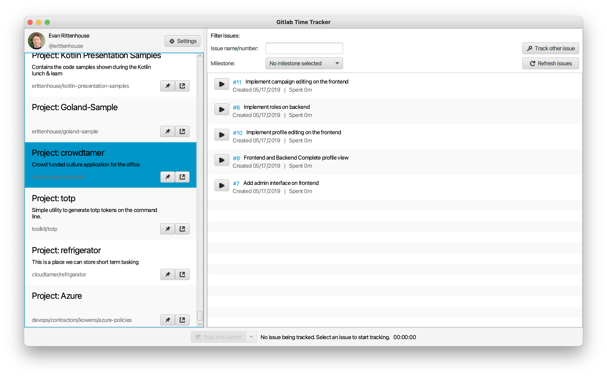

# Gitlab Time Tracker 

The Gitlab Time Tracker is a GUI tool for recording the amount of time you spend on GitLab issues
using the built-in time spend functionality (i.e. `/spend 30m` on an issue). You just click "start" on
an issue for a project you're a part of and the tracker will begin recording the amount of time you spend.
When you click "stop", it immediately records the time spent on the issue in GitLab.

It also has features like:
* Rich and fast filtering of issues for a given project by title, issue number, and milestone
* Slack integration which can auto-update your Slack status when you're working on a task
* Progress bars on issues that have both a time estimate and spend for ease of checking how far along you are on an issue
* Links on every project or issue so you can jump straight from the Time Tracker to GitLab if you need to!

Pull requests are welcome! This project uses Coroutines and TornadoFX.

## Getting started

First things first, head on over to the [releases page](https://github.com/emanguy/GitlabTimeTracker/releases) for this repo and download the latest version of the
application. **Note that this app is built on and for Java 1.8. Newer versions may cause the app to break.**

First, go to Gitlab. This should work both for the public version of GitLab and for private versions.

1. Copy down the base URL for your Gitlab instance. You'll need this during login. For example: `https://www.gitlab.com`.
2. Go to your user settings in GitLab, then "Personal Access Tokens".
3. Create a new personal access token that does not expire with the `api` scope. Copy down the value of your token. Don't worry, Gitlab Time Tracker will remember this after first login.
4. Double-click GitlabTimeTracker-X.X.X.jar to launch the application, and enter your URL and API token to log in.

## Building and running locally

You can build and run the app off your local machine using the included `gradlew` script for your machine. **Java 1.8 JDK is required.**

*Note that if you want to use slack functionality during local development you'll need to define the slack client secret
in the file `src/main/resources/slackClientSecret.txt`.*

To run:

    ./gradlew run
    
To build an executable jar:

    ./gradlew shadowJar

The built jar is output in the generated `build/libs` directory.
